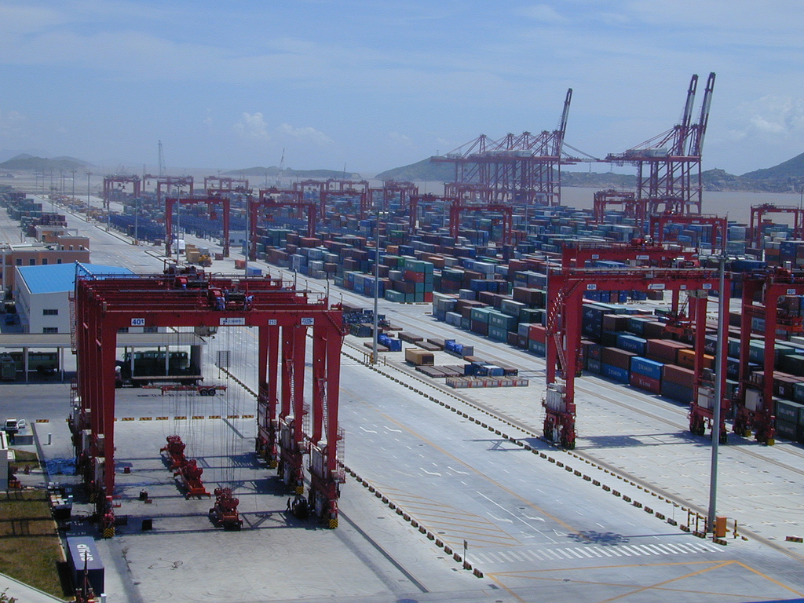

# Gantry

Move container images to and from [IPFS](https://ipfs.io/).

> A container crane (also container handling gantry crane or ship-to-shore crane) is a type of large dockside gantry crane found at container terminals for loading and unloading intermodal containers from container ships.

Also...

> A tall framework supporting a space rocket prior to launching.

So a gantry is basically anything that is used to support the construction of a ship, space or otherwise. Now that's out of the way, let me actually 
explain what this does. So the [Open Container Initiative](https://www.opencontainers.org/) is a sort of standards body that is helping to improve 
the way we handle, store and run containers - hence the name. They host some great libraries, such as [this](https://github.com/containers/storage), which
I found when I first started experimenting with [Buildah](https://github.com/containers/buildah) and [Podman](https://github.com/containers/libpod). 
I've adapted some simple interfaces which use IPFS as a content addressed backend to host all layers that comprise an image, located at the Content 
Identifier (CID) of it's manifest - also used to pull the image back into your local store.



## Getting Started

Download any image to your local store:

```bash
buildah from alpine
```

Push the image to your configured IPFS node, then clear the local store:

```bash
image=$(gantry push -o alpine)
buildah rmi --all
```

Finally, re-download the image from IPFS and check it exists:

```bash
gantry pull -o $image -t alpine
buildah images
```

## Troubleshooting

You may need to enable user namespace cloning in the kernel:

```bash
sysctl -w kernel.unprivileged_userns_clone=1
```